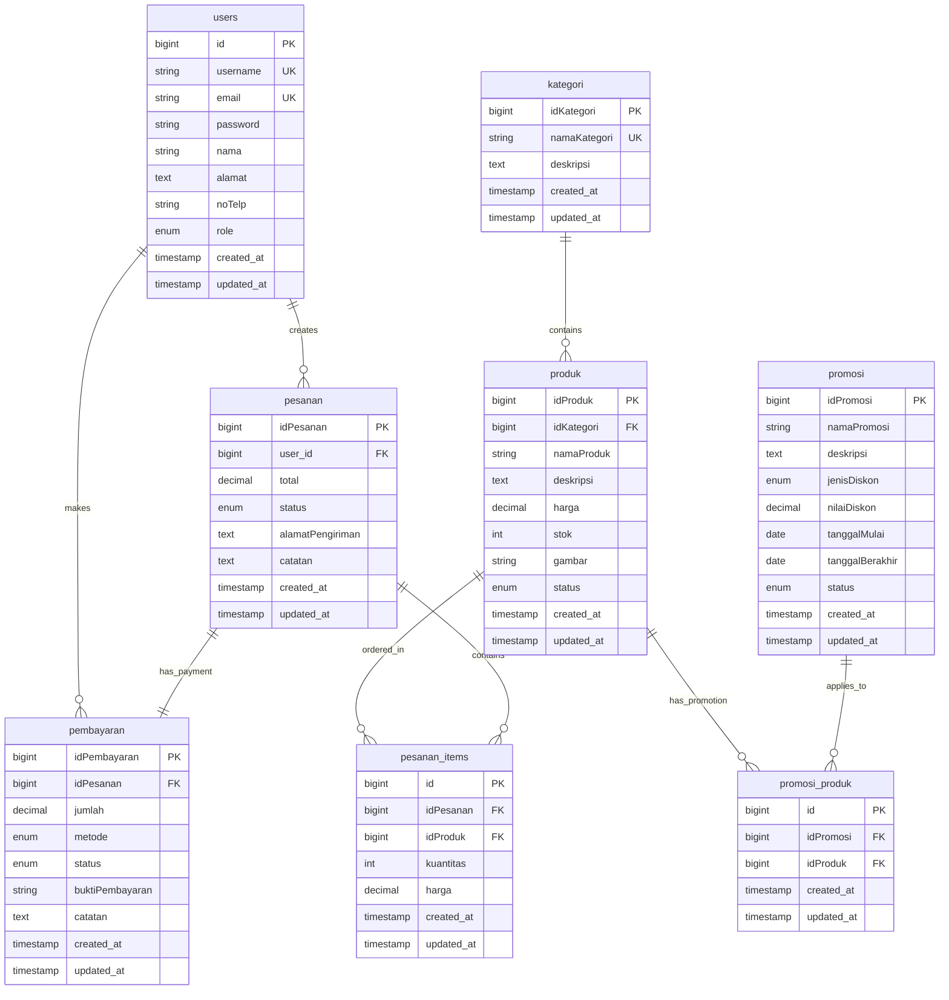

# Database Schema Documentation

## Overview

The Kerajinan E-Commerce system uses MySQL database with the following core tables and relationships.

## Entity Relationship Diagram



## Table Details

### `users`

User accounts for both customers and administrators.

| Column       | Type                     | Constraints                 | Description            |
| ------------ | ------------------------ | --------------------------- | ---------------------- |
| `id`         | BIGINT                   | PRIMARY KEY, AUTO_INCREMENT | Unique user identifier |
| `username`   | VARCHAR(255)             | UNIQUE, NOT NULL            | User login name        |
| `email`      | VARCHAR(255)             | UNIQUE, NOT NULL            | User email address     |
| `password`   | VARCHAR(255)             | NOT NULL                    | Hashed password        |
| `nama`       | VARCHAR(255)             | NOT NULL                    | Full name              |
| `alamat`     | TEXT                     | NULLABLE                    | User address           |
| `noTelp`     | VARCHAR(20)              | NULLABLE                    | Phone number           |
| `role`       | ENUM('admin','customer') | DEFAULT 'customer'          | User role              |
| `created_at` | TIMESTAMP                | NULLABLE                    | Record creation time   |
| `updated_at` | TIMESTAMP                | NULLABLE                    | Last update time       |

**Indexes:**

- PRIMARY: `id`
- UNIQUE: `username`, `email`

### `kategori`

Product categories for organizing products.

| Column         | Type         | Constraints                 | Description          |
| -------------- | ------------ | --------------------------- | -------------------- |
| `idKategori`   | BIGINT       | PRIMARY KEY, AUTO_INCREMENT | Category identifier  |
| `namaKategori` | VARCHAR(255) | UNIQUE, NOT NULL            | Category name        |
| `deskripsi`    | TEXT         | NULLABLE                    | Category description |
| `created_at`   | TIMESTAMP    | NULLABLE                    | Record creation time |
| `updated_at`   | TIMESTAMP    | NULLABLE                    | Last update time     |

**Indexes:**

- PRIMARY: `idKategori`
- UNIQUE: `namaKategori`

### `produk`

Product catalog with inventory management.

| Column       | Type                      | Constraints                 | Description            |
| ------------ | ------------------------- | --------------------------- | ---------------------- |
| `idProduk`   | BIGINT                    | PRIMARY KEY, AUTO_INCREMENT | Product identifier     |
| `idKategori` | BIGINT                    | FOREIGN KEY, NOT NULL       | Category reference     |
| `namaProduk` | VARCHAR(255)              | NOT NULL                    | Product name           |
| `deskripsi`  | TEXT                      | NULLABLE                    | Product description    |
| `harga`      | DECIMAL(12,2)             | NOT NULL                    | Product price          |
| `stok`       | INT                       | DEFAULT 0                   | Available quantity     |
| `gambar`     | VARCHAR(255)              | NULLABLE                    | Product image filename |
| `status`     | ENUM('active','inactive') | DEFAULT 'active'            | Product status         |
| `created_at` | TIMESTAMP                 | NULLABLE                    | Record creation time   |
| `updated_at` | TIMESTAMP                 | NULLABLE                    | Last update time       |

**Foreign Keys:**

- `idKategori` REFERENCES `kategori(idKategori)` ON DELETE CASCADE

**Indexes:**

- PRIMARY: `idProduk`
- INDEX: `idKategori`, `status`

### `pesanan`

Customer orders and order management.

| Column             | Type                                                          | Constraints                 | Description          |
| ------------------ | ------------------------------------------------------------- | --------------------------- | -------------------- |
| `idPesanan`        | BIGINT                                                        | PRIMARY KEY, AUTO_INCREMENT | Order identifier     |
| `user_id`          | BIGINT                                                        | FOREIGN KEY, NOT NULL       | Customer reference   |
| `total`            | DECIMAL(12,2)                                                 | NOT NULL                    | Order total amount   |
| `status`           | ENUM('pending','confirmed','shipped','delivered','cancelled') | DEFAULT 'pending'           | Order status         |
| `alamatPengiriman` | TEXT                                                          | NOT NULL                    | Shipping address     |
| `catatan`          | TEXT                                                          | NULLABLE                    | Order notes          |
| `created_at`       | TIMESTAMP                                                     | NULLABLE                    | Record creation time |
| `updated_at`       | TIMESTAMP                                                     | NULLABLE                    | Last update time     |

**Foreign Keys:**

- `user_id` REFERENCES `users(id)` ON DELETE CASCADE

**Indexes:**

- PRIMARY: `idPesanan`
- INDEX: `user_id`, `status`, `created_at`

### `pesanan_items`

Individual items within an order.

| Column       | Type          | Constraints                 | Description            |
| ------------ | ------------- | --------------------------- | ---------------------- |
| `id`         | BIGINT        | PRIMARY KEY, AUTO_INCREMENT | Item identifier        |
| `idPesanan`  | BIGINT        | FOREIGN KEY, NOT NULL       | Order reference        |
| `idProduk`   | BIGINT        | FOREIGN KEY, NOT NULL       | Product reference      |
| `kuantitas`  | INT           | NOT NULL                    | Quantity ordered       |
| `harga`      | DECIMAL(12,2) | NOT NULL                    | Price at time of order |
| `created_at` | TIMESTAMP     | NULLABLE                    | Record creation time   |
| `updated_at` | TIMESTAMP     | NULLABLE                    | Last update time       |

**Foreign Keys:**

- `idPesanan` REFERENCES `pesanan(idPesanan)` ON DELETE CASCADE
- `idProduk` REFERENCES `produk(idProduk)` ON DELETE CASCADE

**Indexes:**

- PRIMARY: `id`
- INDEX: `idPesanan`, `idProduk`

### `pembayaran`

Payment tracking and verification.

| Column            | Type                                   | Constraints                 | Description            |
| ----------------- | -------------------------------------- | --------------------------- | ---------------------- |
| `idPembayaran`    | BIGINT                                 | PRIMARY KEY, AUTO_INCREMENT | Payment identifier     |
| `idPesanan`       | BIGINT                                 | FOREIGN KEY, NOT NULL       | Order reference        |
| `jumlah`          | DECIMAL(12,2)                          | NOT NULL                    | Payment amount         |
| `metode`          | ENUM('transfer','ewallet','cod')       | NOT NULL                    | Payment method         |
| `status`          | ENUM('pending','confirmed','rejected') | DEFAULT 'pending'           | Payment status         |
| `buktiPembayaran` | VARCHAR(255)                           | NULLABLE                    | Payment proof filename |
| `catatan`         | TEXT                                   | NULLABLE                    | Payment notes          |
| `created_at`      | TIMESTAMP                              | NULLABLE                    | Record creation time   |
| `updated_at`      | TIMESTAMP                              | NULLABLE                    | Last update time       |

**Foreign Keys:**

- `idPesanan` REFERENCES `pesanan(idPesanan)` ON DELETE CASCADE

**Indexes:**

- PRIMARY: `idPembayaran`
- UNIQUE: `idPesanan`
- INDEX: `status`, `metode`

### `promosi`

Promotional campaigns and discounts.

| Column            | Type                       | Constraints                 | Description           |
| ----------------- | -------------------------- | --------------------------- | --------------------- |
| `idPromosi`       | BIGINT                     | PRIMARY KEY, AUTO_INCREMENT | Promotion identifier  |
| `namaPromosi`     | VARCHAR(255)               | NOT NULL                    | Promotion name        |
| `deskripsi`       | TEXT                       | NULLABLE                    | Promotion description |
| `jenisDiskon`     | ENUM('percentage','fixed') | NOT NULL                    | Discount type         |
| `nilaiDiskon`     | DECIMAL(8,2)               | NOT NULL                    | Discount value        |
| `tanggalMulai`    | DATE                       | NOT NULL                    | Start date            |
| `tanggalBerakhir` | DATE                       | NOT NULL                    | End date              |
| `status`          | ENUM('active','inactive')  | DEFAULT 'active'            | Promotion status      |
| `created_at`      | TIMESTAMP                  | NULLABLE                    | Record creation time  |
| `updated_at`      | TIMESTAMP                  | NULLABLE                    | Last update time      |

**Indexes:**

- PRIMARY: `idPromosi`
- INDEX: `status`, `tanggalMulai`, `tanggalBerakhir`

### `promosi_produk`

Many-to-many relationship between promotions and products.

| Column       | Type      | Constraints                 | Description             |
| ------------ | --------- | --------------------------- | ----------------------- |
| `id`         | BIGINT    | PRIMARY KEY, AUTO_INCREMENT | Relationship identifier |
| `idPromosi`  | BIGINT    | FOREIGN KEY, NOT NULL       | Promotion reference     |
| `idProduk`   | BIGINT    | FOREIGN KEY, NOT NULL       | Product reference       |
| `created_at` | TIMESTAMP | NULLABLE                    | Record creation time    |
| `updated_at` | TIMESTAMP | NULLABLE                    | Last update time        |

**Foreign Keys:**

- `idPromosi` REFERENCES `promosi(idPromosi)` ON DELETE CASCADE
- `idProduk` REFERENCES `produk(idProduk)` ON DELETE CASCADE

**Indexes:**

- PRIMARY: `id`
- UNIQUE: `idPromosi`, `idProduk`

## Data Types and Constraints

### Enums Used

#### User Roles

- `admin`: Administrator access
- `customer`: Regular customer access

#### Product Status

- `active`: Available for purchase
- `inactive`: Hidden from customers

#### Order Status

- `pending`: Newly created order
- `confirmed`: Order confirmed by admin
- `shipped`: Order dispatched
- `delivered`: Order received by customer
- `cancelled`: Order cancelled

#### Payment Methods

- `transfer`: Bank transfer
- `ewallet`: Digital wallet payment
- `cod`: Cash on delivery

#### Payment Status

- `pending`: Awaiting verification
- `confirmed`: Payment verified
- `rejected`: Payment rejected

#### Discount Types

- `percentage`: Percentage-based discount (e.g., 20%)
- `fixed`: Fixed amount discount (e.g., Rp 50,000)

#### Promotion Status

- `active`: Currently running
- `inactive`: Disabled

## Key Relationships

### One-to-Many

- `users` → `pesanan` (One user can have many orders)
- `kategori` → `produk` (One category can have many products)
- `pesanan` → `pesanan_items` (One order can have many items)

### One-to-One

- `pesanan` → `pembayaran` (Each order has one payment record)

### Many-to-Many

- `promosi` ↔ `produk` (via `promosi_produk`)

## Indexes and Performance

### Primary Indexes

All tables have auto-incrementing primary keys for optimal performance.

### Secondary Indexes

- User lookups: `username`, `email`
- Product filtering: `idKategori`, `status`
- Order queries: `user_id`, `status`, `created_at`
- Payment tracking: `status`, `metode`
- Promotion filtering: `status`, date ranges

### Query Optimization

- Foreign key constraints ensure referential integrity
- Appropriate indexes for common query patterns
- Enum types for controlled vocabulary fields

## Migration Files

Located in `database/migrations/`:

- `0001_01_01_000000_create_users_table.php`
- `0001_01_01_000001_create_cache_table.php`
- `0001_01_01_000002_create_jobs_table.php`
- Additional migrations for e-commerce tables

## Seeders

Located in `database/seeders/`:

- `DatabaseSeeder.php`: Main seeder orchestrator
- Individual seeders for each table with sample data

## Database Configuration

Located in `config/database.php`:

```php
'mysql' => [
    'driver' => 'mysql',
    'host' => env('DB_HOST', '127.0.0.1'),
    'port' => env('DB_PORT', '3306'),
    'database' => env('DB_DATABASE', 'kerajinan'),
    'username' => env('DB_USERNAME', 'root'),
    'password' => env('DB_PASSWORD', ''),
    'charset' => 'utf8mb4',
    'collation' => 'utf8mb4_unicode_ci',
    'options' => [
        PDO::ATTR_STRINGIFY_FETCHES => false,
        PDO::ATTR_EMULATE_PREPARES => false,
    ],
],
```
